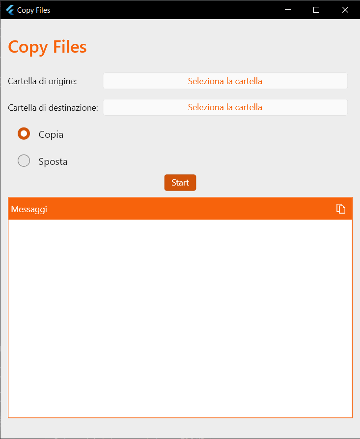

# copy_files

Copy Files è un progetto scritto in Flutter per estrarre tutti i file presenti in una cartella di origine `target`, e in tutte le sue sotto cartelle, in una cartella di destinazione

L'applicazione è stata testata per **Windows**, non è garantita la correttezza per altre piattaforme

### Example
```
+---target
|   |   file.txt
|   |   
|   \---subfolder
|       |   file.txt
|       |   
|       \---subsubfolder
|               file.txt
|               
\---destination
        file.txt
        file_1.txt
        file_2.txt
```

In caso di file con nome duplicato l'applicazione aggiungerà al nome del file `_{n}` dove `n` sarà il il primo intero positivo che non causa un conflitto

## How to use

L'applicazione si presenta con la seguente schermata



1. Selezionare la cartella di origine `target`
2. Selezionare la cartella di destinazione `destination`
3. (opzionale) Selezionare l'algoritmo da utilizzare, di default i file vengono copiati
4. Selezionare il pulsante `Start`
5. Attendere il completamento dell'operazione

## Download

Per scaricare l'applicazione fare riferimento alla pagina delle [Releases](https://github.com/Meneghin98/copy_files/releases) per scaricare l'ultima versione disponibile

## Getting Started

Prima di iniziare, verificare che flutter sia installato correttamente, per fare ciò eseguire il seguente comando: 
```
flutter doctor
```
Se sono presenti degli errori fare riferimento alla documentazione ufficiale di flutter. 

Per apportare modifiche all'applicazione, una volta clonata la repository,
eseguire i seguenti comandi:
```
flutter pub get
flutter run
```
L'applicazione dovrebbe quindi avviarsi correttamente ed è possibile iniziare ad apportare modifiche al codice